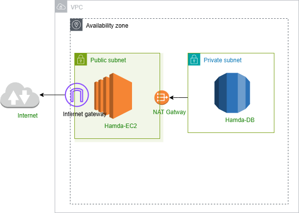

# AWS VPC Terraform Project

This project provisions a simple AWS Virtual Private Cloud (VPC) environment using Terraform. The infrastructure is designed for a single availability zone and includes both public and private subnets.

## Features

- **VPC**: Custom virtual network for your AWS resources.
- **Public Subnet**: Hosts resources that need direct access to the internet.
- **Private Subnet**: Hosts resources that should not be directly accessible from the internet.
- **EC2 Instance**: Virtual server deployed in the public subnet.
- **RDS (Relational Database Service)**: Managed database instance deployed in the private subnet.
- **Internet Gateway**: Enables internet connectivity for resources in the public subnet.
- **NAT Gateway**: Allows resources in the private subnet to access the internet securely.

## Architecture Diagram

## Usage

1. Clone this repository.
2. Update the Terraform configuration files with your desired parameters.
3. Run `terraform init`, `terraform plan`, and `terraform apply` to provision the infrastructure.

---

This setup is ideal for basic web applications requiring a secure backend database and public-facing